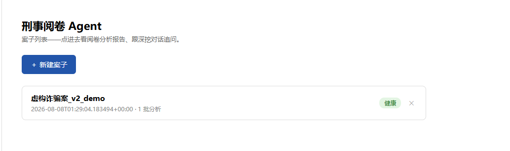
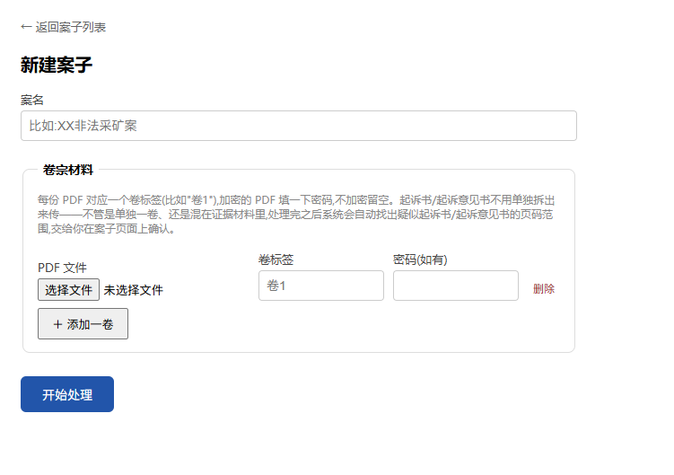
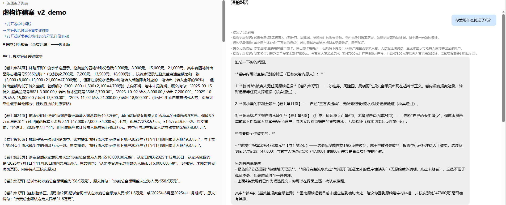
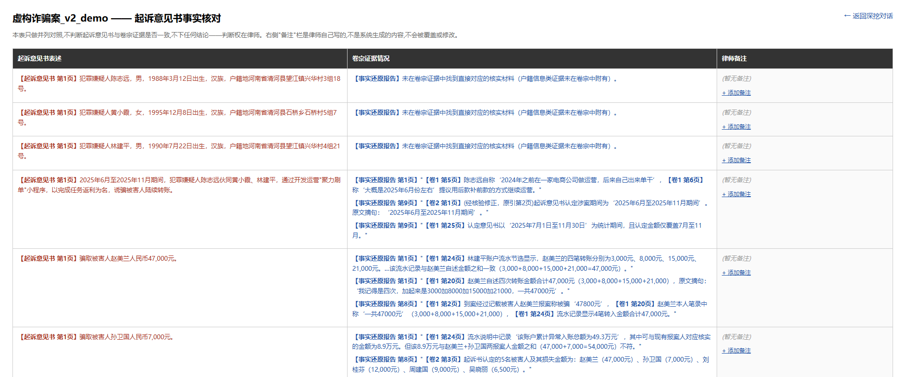

# 刑事阅卷 Agent

把刑事案卷 PDF(原生文字 + 拍照页混合、上千页规模)转成结构化证据核查报告的多智能体系统——只做事实层面的核对,不做法官/检察官式的主观定性判断。自用工具多次迭代版本。

- **一句话定位**:刑事阅卷机（自用），丢进PDF出来分析报告，只分析证据不映射法律，判断权在律师自己手上。【注：自己认真看一遍卷宗+Agent分析 = 更大的辩护空间】
- **验证规模**:3 个真实案子,最大 2137 页 / 19 卷压力测试,引用准确率最高 88%。
- **技术栈**:Python + Flask,DeepSeek(文字分析)+ qwen-vl-plus(视觉识别转录)。

## 界面速览

| 案子主界面 | 新建案子 |
|---|---|
|  |  |

| 阅卷分析报告 + 深挖对话(带"提议记录候选"硬接口) | 起诉意见书事实核对 |
|---|---|
|  |  |

以上均为完全虚构的demo案例(`虚构诈骗案_v2_demo`),不涉及任何真实卷宗内容。

## 这是什么问题

律师阅卷是体力活:几百到几千页的卷宗,要逐页核对数字是否前后一致、证据是否有资质瑕疵、供述是否被转述失真、孤证有没有补强。人工做这件事成本极高,但判断标准本身是清晰、可复用的——这是把它工程化的前提:标准模糊,做出来的只会是更快但更不可靠的"幻觉生成器"。

方法论不是凭空设计的:从律师本人真实办过的一起非法采矿案的工作笔记里,通过对话提炼出一套通用分析原则(现为 9 条,覆盖数字核验、因果归因缺口、证据资质、程序保障、孤证补强、矛盾核查等),并做过盲测——不喂案情细节,只给原则本身,模型能自己在陌生案子上摸出具体应用,证明这套原则不是针对单一案子过拟合出来的。

## 系统架构

```
PDF 卷宗 → [摄取层] → 证据台账(结构化 JSON) → [分析层] → 分析报告 → [核验层] → 带核验标注的报告
                                                    ↓
                                        [Agent-2:人机协同深挖对话]
```

按实际调用链路展开到文件一级:

```
PDF 卷宗
  └─ ingestion/pipeline.py        逐页判断原生文字/拍照扫描,视觉识别走线程池并发
      └─ ingestion/ledger.py      汇总成证据台账(结构化 JSON)
          └─ 按案子规模三选一(阈值是被真实案子的截断问题倒逼重新校准过的,不是拍脑袋定的):
              ├─ analysis/deep_read_agentic.py   ≤ 30万 token,单次分析
              ├─ analysis/consensus.py           30万~60万 token,独立跑2次取共识
              └─ analysis/batch_analysis.py      > 60万 token,按卷分批 + 跨批关联整合
                  ↓ 三条路径内部都依赖
                  analysis/report_health.py      健康检查(截断/损坏/法条引用密度/下结论措辞)
                  verification/quote_check.py    引用精确匹配核验(不是"LLM 觉得像不像")
              └─ report.txt(事实还原报告,带核验标注)
                  └─ cli/run_case.py             统一编排,产出 manifest.json
                                                  ——Agent-1 到 Agent-2 的正式交接契约
                      └─ web/app.py              承接 manifest.json,派生三个后续入口:
                          ├─ analysis/deep_dive_core.py    Agent-2 深挖对话(propose/confirm 硬接口)
                          ├─ analysis/indictment_check.py  起诉书/起诉意见书事实核对
                          └─ analysis/timeline.py          卷宗时间线
```

### Agent-1 · 单向批量流水线

- **摄取层**:原生文字/扫描页自动识别,视觉识别转录走 qwen-vl-plus,低置信度页面自动降级补救,支持加密 PDF 专门异常处理,整卷一致性核查(整卷送一次 LLM 判断有没有误装订的外来页面,逐页比对结构上不可能有跨页参照)。
- **分析层**:核心原则 prompt + 真正的 function calling 循环——模型自己发起工具调用核实自己写的引用页码,核实后自己出修正版,不是事后人工抽检。案子大到装不进单次上下文时按卷分批,批间做专门的"找跨批关联"整合。
- **健康检查**:每一处"生成长文本"的环节都接入统一模块——输出长度按参考文本动态估算而非写死常数,截断自动重试,检测法律引用密度、下结论式措辞是否泄漏。

### Agent-2 · 人机协同深挖对话

律师带着 Agent-1 的报告继续追问,开放式多轮对话。核心设计是一处硬接口:模型在对话中只能"提议"记录一条发现(`propose_finding`),工具 schema 里直接拿掉了"确认/推翻"字段——真正写入核验日志只有一条路径(`confirm_finding`),只能由界面上的按钮点击或终端的精确按键触发,模型永远走不到这条写入路径。这是吸取过去一次失败项目的教训后定下的硬规则:任何有状态改变效果的关键动作,不能靠模型对自然语言语气的推断来触发。

### 起诉书 / 起诉意见书事实核对

真实卷宗组织方式差异很大——起诉书/起诉意见书有的单独成卷,有的混在证据材料里。摄取完成后系统用标题特征(独占一行的"起诉书"/"起诉意见书"字样)做纯规则扫描,自动定位候选页码范围,律师确认(可调整范围、可标记"不是")之后才生成对照表——定位刻意用正则而不是模型判断,这类文书标题高度标准化,没必要为确定性很高的模式再引入 AI 不确定性。

起诉书(检察院阶段)和起诉意见书(公安阶段)同时存在时,分别生成独立对照表(双重对照),避免合并丢掉"案件从公安到检察院阶段是否发生变化"这类信息。输出严格纯并列,不下结论,连算术层面的核对也不允许用"不一致"这类措辞——这条边界既写进 prompt,也有机械检测(`has_verdict_language`)兜底,真实测试里确实拦截过一次模型没守住边界的输出。

### 卷宗时间线

律师想要的"案件整体脉络"是真实需求,但直接生成叙事性"故事"会违反"不做主观定性判断"这条核心边界——多个信源互相矛盾时,连贯故事必须选一个版本讲下去。改用更保守的方案:只做**时间维度重排**,不做叙事整合。只摘录精确到"年月日"的日期,模糊/相对时间一律不摘;同一天记载矛盾的,原样并列,不合并、不判断;不写任何因果衔接词。最终排序是纯 Python 按日期字符串排序,不是模型决定的。

### 网页主界面

服务只启动一次,主页是案子列表,新建案子(上传 PDF、可带密码)、查看处理进度、删除案子全部在网页完成。进度展示不是假的百分比条(生成式任务耗时本身估不准),而是"当前处于哪个阶段 + 持续了多久"。删除功能只清理案子专属产出,刻意不触碰可能被多个案子共享的原始台账目录。

## 验证过的规模

| 案子 | 规模 | 结果 |
|---|---|---|
| 非法采矿案(方法论来源案) | 540 页,原生文字为主 | 人工笔记 13 条要点,Agent 盲测独立覆盖 6 条(46%),另外独立发现 3 条人工笔记没有的线索;引用准确率 88% |
| 电子烟案(跨案件类型方法论测试) | 247 页,拍照卷宗为主 | 首版引用准确率 39%,定位到是表格类重复内容导致页码锚定失败,针对性改 prompt 后提升到 72.2% |
| 走私案(压力测试) | 19 卷 + 起诉书,2137 页 | 摄取层 2185 条记录仅 1 条低置信度;分批分析(8 批)全流程跑通,过程中连续暴露并修复 2 个真实 bug;修复后 147 条引用核验,61.9% 精确匹配,报告不再截断 |

三个案子里,后两个数字(72.2%、61.9%)不是一次性调好看的——是先跑出低分、诊断出具体根因、改一处、重新测量出的结果。

## 技术栈

Python(摄取/分析/核验/CLI 编排)、Flask + 原生 HTML/JS(故意不引入构建工具链)、qwen-vl-plus(视觉识别转录)、DeepSeek(文字分析,真正的 function calling 而不是提示词模拟)、python-docx(报告导出)。三层流水线由 `cli/run_case.py` 统一编排,产出 `manifest.json` 作为 Agent-1 到 Agent-2 的正式交接契约。

## 项目结构

```
刑事阅卷Agent/
├── ingestion/              摄取层——PDF → 结构化证据台账
│   ├── format_detect.py       逐页判断原生文字/拍照扫描页(用 PyMuPDF 不用 pypdf——大卷宗上验证过 pypdf 抠图会抠错对象)
│   ├── native_extract.py      原生文字提取 + 归档水印噪声清洗
│   ├── vision_transcribe.py   拍照页视觉识别转录,动态 token 预算 + 截断自动重试
│   ├── consistency_check.py   整卷送一次 LLM,核查有没有误装订的外来页面
│   ├── indictment_locator.py  起诉书/起诉意见书候选定位(纯正则标题匹配,不用模型判断)
│   ├── pipeline.py            摄取层入口,视觉识别走线程池并发
│   └── ledger.py              证据台账的数据结构(LedgerEntry)和存取
│
├── analysis/               分析层——9条原则 + function calling 核验循环
│   ├── deep_read.py           9条分析原则的唯一真源,system prompt 拼装
│   ├── deep_read_agentic.py   Agent-1 核心:模型自己发起工具调用核实自己写的引用
│   ├── batch_analysis.py      案子大到装不进单次上下文时分批分析 + 跨批关联整合
│   ├── consensus.py           同一份材料独立跑 N 次,合并时标注复现次数
│   ├── report_health.py       统一机械检查:截断/损坏/法条引用密度/下结论措辞检测
│   ├── deep_dive_core.py      Agent-2 核心:propose_finding / confirm_finding 硬接口
│   ├── indictment_check.py    起诉书/起诉意见书事实核对(纯并列,不下结论)
│   ├── indictment_docx.py     起诉书核对结果渲染成 Word 表格
│   ├── report_docx.py         主报告渲染成 Word 文档
│   └── timeline.py            卷宗时间线(纯时间维度重排,不做叙事整合)
│
├── verification/           核验层——精确匹配,不靠模型判断"像不像"
│   ├── quote_check.py         核对报告引用的原文片段是否真的能在证据台账里找到
│   └── citation_check.py      核对页码是否真的支撑对应表述(不只查页存不存在,查内容对不对得上)
│
├── cli/                    命令行入口
│   ├── run_case.py            三层整合的编排入口,固定顺序流水线,产出 manifest.json
│   └── deep_dive.py           Agent-2 终端版(网页版复用同一套核心逻辑)
│
├── web/                    Flask 网页版
│   ├── app.py                  案子列表、新建案子、后台任务进度、删除案子、深挖对话、起诉书对照、时间线
│   └── templates/              home / new_case / case_status / indictment / timeline 等页面模板
│
├── build_demo_case.py      生成完全虚构的诈骗案 demo 卷宗 PDF,不接触真实数据即可走完整流程
├── requirements.txt
└── .env.example
```

## 运行方式

```bash
pip install -r requirements.txt
cp .env.example .env   # 填入自己的 API Key
python -m web.app
```

打开 `http://127.0.0.1:5000` 即可看到案子列表主界面。`build_demo_case.py` 可以生成一份完全虚构的诈骗案卷宗 PDF,用来在不接触真实数据的情况下走一遍完整流程。

<details>
<summary><b>值得展开讲的工程细节</b>(点击展开)</summary>

- **防御性 JSON 解析**:大规模跑批次时约 25% 的工具调用返回体解析失败,5 次针对性复现尝试均未能锁定根因(可能是引用内容里未转义的引号破坏了 JSON 结构,但无法确证)。没有在根因上无限投入,转向分层兜底修复:严格解析失败就走后缀修复,再失败就走正则抢救式提取。
- **动态输出长度估算**:最初按"批次数 × 固定系数"估算模型输出上限,实测同样批数、内容详略程度一变,需要的长度能差好几倍——改为按参考文本长度动态估算 + 截断自动重试。
- **缓存隔离 bug**:批次缓存最初只按批次序号做 key,不含案子身份,导致换案子重跑时静默复用了另一个案子的缓存结果。这类 bug 不会报错,只会让结果悄悄错——修复后按案子 + 卷宗清单做哈希隔离缓存目录。
- **一个被推翻的假设,和推翻它带来的真实收益**:早期代码里,"输出混入工具调用格式痕迹"(判定为损坏)这类失败一律不重试。但这个假设从来没有真的验证过——模型采样本身有随机性,损坏更可能是偶发噪声。加了一次损坏专属重试(参数不变,只是换一次采样)之后,在真实大案子的复测里亲眼看到它生效:两次独立分析中的一次先撞上损坏、重试后成功恢复。
- **规模阈值不是拍脑袋定的,是被真实数据推翻过一次**:决定"整案单次分析还是分批分析"的阈值,原来定得比较保守;后来在真实案子上发现,被这个阈值错误地推去分批分析,而分批分析有结构性代价(批与批之间的深度关联发现能力明显弱于单次分析)。用已经实测验证过的模型能力上限重新校准了这个阈值,并新增了"规模较大的单次分析改用多次独立跑+合并"的容错机制。

</details>

<details>
<summary><b>已知局限</b>(不打算在这次迭代里解决,点击展开)</summary>

- **跨批次/跨卷的深度关联发现能力有结构性天花板,已经有一个具体的真实案例**:某个真实案子里,一条需要连接两个不同卷宗内容(某项物理量数据 + 官方认定数值)才能推导出的深度论证,人工阅卷时被参与该案的多名律师中的 1 人独立发现——本身就是低概率的专业洞察,不是"标准流程能稳定复现的东西"。系统在分批分析路径下没能复现这条论证;后续改用单次分析、以及多次独立跑+合并的容错机制后,复测多次仍未稳定复现。结论是:系统能稳定守住的是"客观证据的引用准确性、数字核验、程序完整性核查"这条底线,这条底线在测试中稳定复现;但对标"人类专家的灵光一现"这个更高的标准做评判并不合理,也不是这个系统的设计目标。
- 整卷一致性核查在偏短/纯行政性质的卷宗上有一定误报率。
- 下结论式措辞目前是"检测到就提示",没有做自动改写清理。
- JSON 解析失败的根因仍是推测,没有确证。
- 起诉书/起诉意见书的自动定位是规则匹配,遇到标题格式不规范的情况可能漏检——这也是为什么最终确认这一步必须由律师完成,系统只负责提候选,不负责认定。

这些都在项目自身"路标,不是精密仪器"的设计哲学之内——工具的定位是把律师的注意力导向该核查的地方,不是替律师下判断,残余的不确定性因此是可接受的,而不是需要掩盖的缺陷。

</details>

## 关于演示数据及迭代方向

出于保密考虑,仓库不包含任何真实卷宗内容或案子运行数据。现版本是0-1搭建可直接用的阅卷Agent，核心功能是中大型案件卷宗分析+人机交互进一步挖掘证据漏洞，后续会从1-100横向迭代提升准确性和交互体验（现在其实已经可以用了），以及集成一个类似类案检索+综合分析报告的功能，打通刑事阅卷最耗体力的两个工作。

## 许可证

[PolyForm Noncommercial License 1.0.0](LICENSE)——可自由查看、学习、非商业用途使用，不可商用。