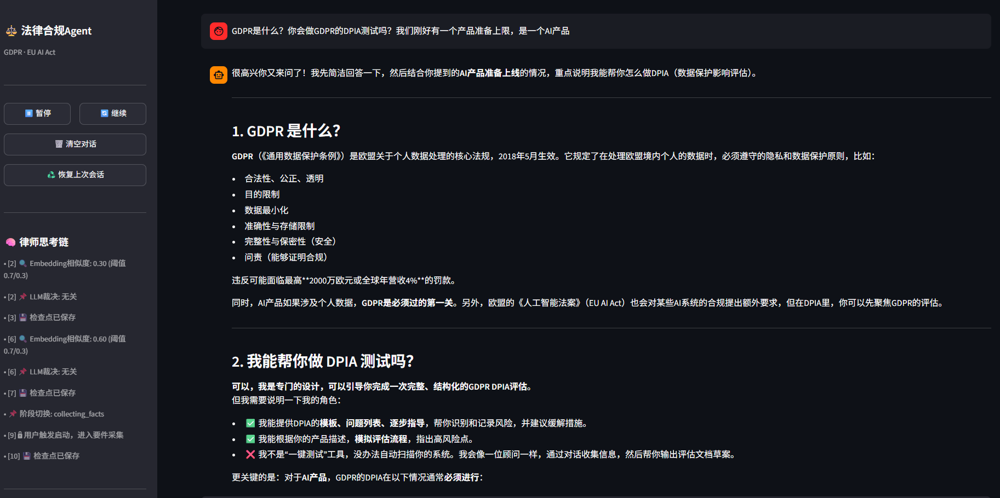
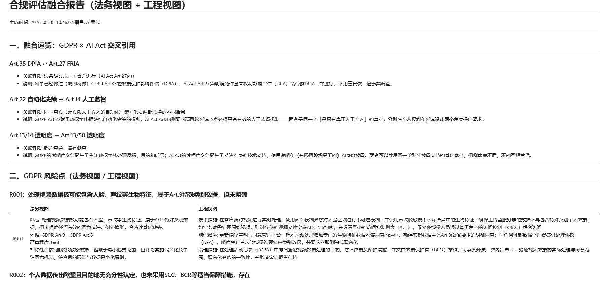
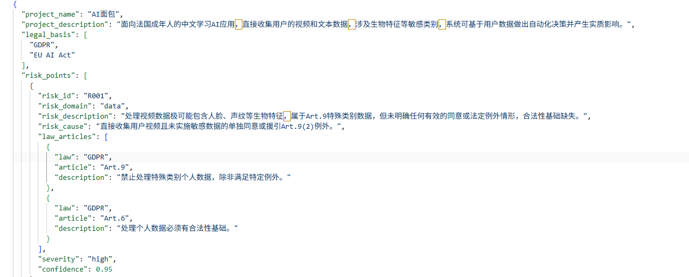
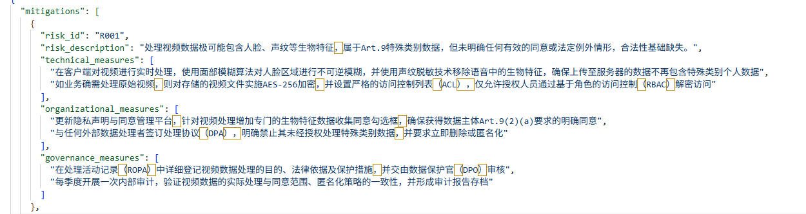
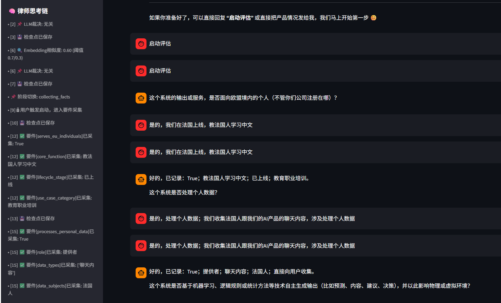

# 法律合规 Agent —— GDPR × EU AI Act

把一段自然语言业务场景描述,转成带法条依据、可追溯、法务/工程双视图的合规分析报告的对话式 Agent。【注：后续会往真实工作环境迭代，直接分析PDF输入数据】

- **一句话定位**:法律测试能拆成构成要件的(规则型),交给代码机械推导,结论不是模型生成的;本身需要专业裁量的(权衡型),让模型论证但强制标注"专业判断,建议律师复核",不包装成确定结论。
- **验证方式**:基于 DeepSeek API 的真实多轮实测(非模拟调用),含一次自己实测发现、定位根因、修复并重新验证通过的跨模块事实不一致 bug——过程见下文"真实调试历程"。
- **技术栈**:Python + Streamlit,DeepSeek(事实抽取 + 权衡型论证,不用于规则型结论)。

## 界面速览



对话式前端,左侧是律师思考链(实时暴露每一步内部判断)和当前状态面板,右侧是正常对话。下面每个claim旁边都配了对应的真实运行截图,不是复述文字。



这张是整个项目最核心的产出——同一个场景("AI面包"中文教学App)下,GDPR 与 AI Act 的交叉引用(Art.35↔Art.27、Art.22↔Art.14、透明度义务重叠)和法务/工程双视图并排呈现,都是真实运行产出,不是手写示例。

## 这是什么问题

合规判断本身有清晰、可复用的标准——法律测试都能拆出构成要件,这是把它工程化的前提。但生成式 AI 的危险不在"答错",而在把"能机械推导的判断"和"本来就需要专业裁量的判断"混成同一种语气输出——两者一旦被同一种确定性包装,幻觉就有了藏身之处。

这个项目的方法论是把每个法律测试先分类再处理:

- **规则型**:要件之间是明确的逻辑关系(满足几项/命中即触发),交给代码 if/else 推导,模型只负责从场景描述里抽取事实,不参与下结论。六个决策枢纽里五个是这一类。
- **权衡型**:没有唯一正确答案,本质上要靠专业判断(比如 GDPR 正当利益的三步平衡测试),模型可以论证,但结论强制标注"需人工复核",不会被当成确定结论输出。

## 系统架构

```
用户输入
  → Stage-0  适用性门槛判断(是否落入 GDPR / AI Act 范围)
  → Stage-1  要件驱动对话式收集(FactStore,逐句扫描未知要件,非线性表单)
  → Stage-2  六个决策枢纽判断(规则型代码推导 + 权衡型模型论证)
  → Stage-3  引用核验(比对本地语料库,未收录条文标"未核实"而非"错误")
  → 融合层:跨法规交叉引用(如 Art.22 ↔ AI Act Art.14 透明度义务)
  → 双视图报告渲染(法务视图 / 工程视图)
```

按实际调用链路展开到文件一级:

```
用户一句话场景描述
  └─ lawyer_shell.py                对话编排入口,Stage 流转 + 要件收集 + 引擎调度
      └─ intake/gate.py             Stage-0:GATE_FIELDS 命中判断是否落入两部法规范围
      └─ intake/extractor.py        Stage-1:逐句抽取事实,写入 context_manager.py 的 FactStore
          ↓ 要件收集到位后
      └─ modules/gdpr_hub_analysis.py   GDPR 五枢纽:先抽取事实,已知事实(known_facts)硬约束覆盖,不被重新猜测
          └─ modules/gdpr_hubs.py       五个规则型判断函数,纯 if/else
      └─ modules/main.py                AI Act 流水线:角色判定 → 风险分级 → 义务查表
          └─ modules/ai_act_hubs.py     风险分级 + 角色→义务表 + 生效日期动态计算
      └─ modules/risk_identification.py  Harness(Brain/Executor/Observer/Ledger)驱动多轮生成
          └─ 引用核验:比对 schemas/gdpr_articles.json,未收录标"未核实"
      └─ fusion/cross_reference_map.py  跨法规交叉引用规则(硬编码的真实条文关联,非模型现编)
          └─ fusion/report_builder.py   同一份 JSON 结论,渲染成法务视图 + 工程视图两份报告
```

### 六个决策枢纽

| 枢纽 | 法条依据 | 判断方式 |
|---|---|---|
| 自动化决策 | GDPR Art.22 | 三要件(决定存在性/人工介入程度/影响重大性)规则型判断 |
| 合法性基础 | GDPR Art.6 | 五项规则型基础 + 第六项(正当利益)三步权衡测试 |
| DPIA 门槛 | GDPR Art.35 + WP29九因素 | 命中≥2项即触发 |
| 跨境传输机制 | GDPR Ch.V | 充分性认定 / SCC / BCR / Art.49例外,顺序判定 |
| 处理者关系 | GDPR Art.28 | controller/processor 关系判定 + DPA 是否签署 |
| AI 风险分级 | AI Act Art.5 + Annex III + Art.50 | 禁止清单短路判断 → 高风险场景 → 透明度义务 → 最小风险 |

以下是同一个"AI面包"场景真实跑出来的结构化产出(不是手写示例),分别对应 `risk_identification.py` 的风险点输出和 `mitigation_design.py` 的 Art.25/32 三层缓解设计——每条风险都带 `law_articles` 字段级引用和 `confidence` 置信度,不是一段自然语言文字堆出来的:

| 风险识别输出(`risk_identification.py`) | 缓解措施输出(`mitigation_design.py`) |
|---|---|
|  |  |

### 要件驱动对话(而不是线性表单)

用户一句话经常同时透露好几个要件,线性表单会浪费掉、还会让用户重复回答已经说过的内容。`FactStore` 每轮扫描所有当前"未知"的要件,尽量一次性多抽取几个;抽不到的字段才追问,且用 `ask_counts` 记录被追问次数——同一个字段被问了 3 次还没答上来,会主动让位给其他还开放的问题,而不是卡在原地反复问同一句话。



这张截图能看到侧边栏思考链在实时暴露内部判断过程——`Embedding相似度: 0.60`(阈值0.7/0.3)、`LLM裁决: 无关`、`阶段切换: collecting_facts`、逐条 `要件[xxx]已采集`——不是黑箱,每一步为什么这么判都留了痕。

### 引用核验:未收录不等于错误

模型给出的每条法条引用都会比对本地语料库(`schemas/gdpr_articles.json` / `law_texts.json`,覆盖六个枢纽直接相关的核心条文,非全文收录)。语料库外的引用标注"未核实,建议人工确认",不会被误判成"编造"——语料库范围本身是有意识的取舍,不是覆盖不全就该被当成错误。

### 双视图报告

同一份底层 JSON 结论,法务视图要的是依据和结论性质,工程师要的是改哪个字段、验收标准是什么,分开渲染,不硬塞进同一段话里。

### 自循环 Harness

Brain / Executor / Observer / Ledger 闭环贯穿 Stage-1~3,每轮输出过一遍完整性检查才采信,不是生成完就直接当结论用。Ledger 同时记录模型名称、语料库版本、时间戳,结论可追溯。

## 真实调试历程

不是一次写完就没再改过。开发过程中几个真实发现并修复的问题:

- **模型把该是数组的字段返回成字符串**(`legal_basis` 等):prompt 文字描述不够精确,加了明确 JSON 结构示例后修复。
- **AI Act 角色/风险等级曾经硬编码**:原来无论输入什么场景,系统永远判定"提供者 + 高风险",后来改成真实的角色分流(提供者/部署者/进口商/分销商)+ 风险分级判定。
- **模型给部署者多加了不该有的条款,同一条款内部子款又被拆成重复条目**:两个问题都靠代码侧过滤(按角色限定可推荐条文范围)+ 按条文号去重合并解决,没有指望靠改 prompt 硬控制住。
- **要件收集阶段的死循环**:第一版里,排在最前的未答字段如果用户答不上来,会被原样重复问下一轮——第一次真实对话测试就撞上了。加了 `ask_counts` 追问次数记录,超过阈值就换个问法或让位给其他字段。
- **跨模块事实不一致(自己实测发现,不是靠代码审查发现的)**:一次自测中给出"存在无人工介入、有实质影响的自动化决策"这条明确事实后,GDPR 枢纽内部另一个独立的事实抽取模块又把同一段场景描述重新读了一遍,给出了更保守的结论,导致 Art.22 被误判不适用,连带影响了 Art.22 ↔ AI Act Art.14 这条跨法规交叉引用没有触发。根因是"已经问过、已经确认的事实,又在下游被重新猜了一遍"。修复方式是把 Stage-1 确认过的事实作为 `known_facts` 硬约束传给下游枢纽,不允许被重新推翻。修复后重跑同一场景,三条预期的跨法规交叉引用(DPIA↔FRIA、Art.22↔Art.14、透明度义务重叠)全部正确触发。

## 技术栈

| 组件 | 选型 | 用途 |
|---|---|---|
| 前端 | Streamlit | 对话式界面,实时思考链、状态面板、会话恢复(`checkpoints/`) |
| LLM | DeepSeek API | 事实抽取 + 权衡型论证,**不**用于规则型结论 |
| 输出约束 | JSON Schema | 强制模型输出结构化字段(`schemas/`) |
| 引用核验 | 本地语料库 | 覆盖六个枢纽直接相关的核心条文,非全文收录 |

## 项目结构

```
法律合规Agent/
├── lawyer_shell.py            对话编排入口,Stage 流转 + 要件收集 + 引擎调度
├── context_manager.py         会话状态:对话历史、思考链、FactStore
├── run.py / app.py            启动脚本 / Streamlit 前端
│
├── intake/                    Stage-0/1:适用性门槛 + 要件抽取
│   ├── gate.py                   GATE_FIELDS 命中判断是否落入 GDPR/AI Act 范围
│   ├── profile_template.py       完整要件字段模板
│   └── extractor.py              逐句扫描未知要件,尽量一次多抽取几个
│
├── modules/                   Stage-2:六个决策枢纽
│   ├── gdpr_hubs.py               GDPR 五个规则型判断函数,纯 if/else
│   ├── gdpr_hub_analysis.py       要件抽取 + 枢纽判断整合,known_facts 硬约束覆盖入口
│   ├── ai_act_hubs.py             AI Act 风险分级 + 角色→义务查表 + 生效日期动态计算
│   ├── risk_identification.py     风险识别 Harness + Stage-3 引用核验
│   ├── mitigation_design.py       Art.25/32 技术/组织/治理三层缓解措施设计
│   └── main.py / rules_layer.py / analysis_layer.py   AI Act 分析流水线
│
├── fusion/                    融合层:跨法规交叉引用 + 双视图渲染
│   ├── cross_reference_map.py    硬编码的真实条文关联规则(非模型现编)
│   └── report_builder.py         同一份 JSON 渲染成法务视图 / 工程视图
│
├── harness/                   自循环 Harness:Brain / Executor / Observer / Ledger
├── schemas/                   法条语料库(gdpr_articles.json / law_texts.json)+ 输出结构约束
├── glossary/                  法律 ↔ 工程术语双向映射
├── outputs/                   示例运行产出(完整一轮真实测试场景的全部报告)
└── requirements.txt
```

## 运行方式

```bash
pip install -r requirements.txt
export DEEPSEEK_API_KEY="your-api-key"
python run.py
```

浏览器打开 `http://localhost:8501` 即可开始对话。

<details>
<summary><b>已知局限</b>(点击展开)</summary>

- 语料库只覆盖与六个决策枢纽直接相关的约 17 条 GDPR + 16 条 AI Act 条文,不是全文收录。
- 权衡型判断(如正当利益平衡测试)本质上不保证"正确",只保证有实质论证内容 + 强制标注复核,最终判断权始终在人工手上。
- 不处理供应商 DPA 谈判、真实数据泄露应急响应等操作性事务——这是面试作品的范围控制,不是能力上限。
- 验证方式是开发过程中的多轮真实 API 端到端实测,**不是**大规模、多案例的生产级压力测试——这一点和体量更大的[刑事阅卷 Agent](../刑事阅卷Agent_Git/README.md)不是同一个量级,不应该被混为一谈。
- `lawyer_shell.py` 里仍保留一层基于 sentence-transformers 的 embedding 相关性判断(`_double_funnel`),用来预判用户这句话值不值得进入合规评估流程——这是早期"语义路由"设计的遗留,和"六个决策枢纽全部代码化"这条核心叙事不完全在同一条线上,是待清理项而非刻意设计。

</details>

## 关于这个项目的定位

本项目是**作品集/技术演示项目**,输出内容**不构成法律意见**。权衡型判断的结论均标注"需人工复核",任何真实合规决策都应由具备资质的律师复核后作出。

## 许可证

[PolyForm Noncommercial License 1.0.0](LICENSE)——可自由查看、学习、非商业用途使用，不可商用。
