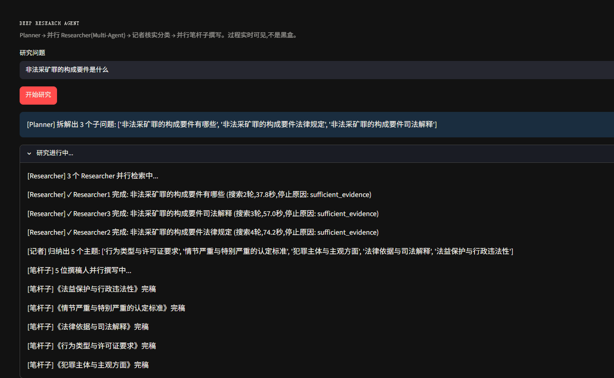
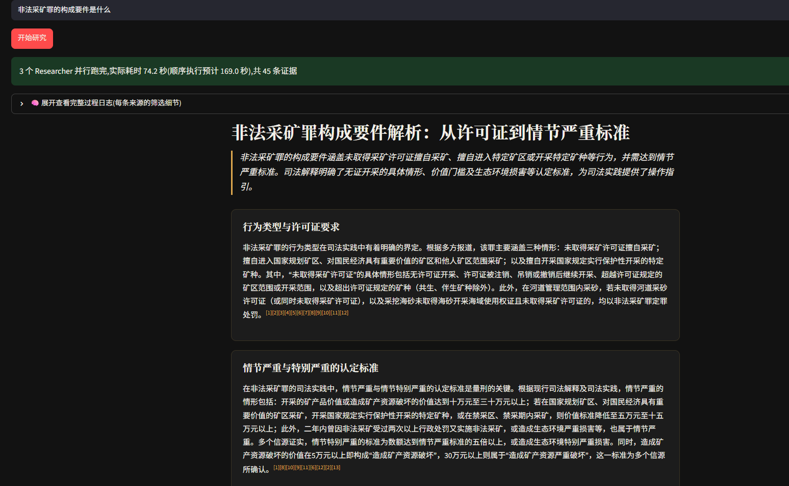
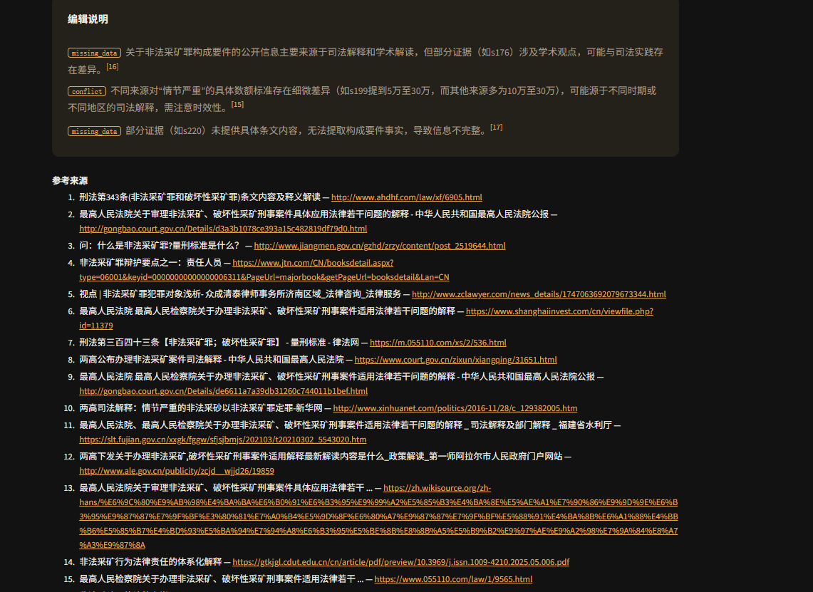
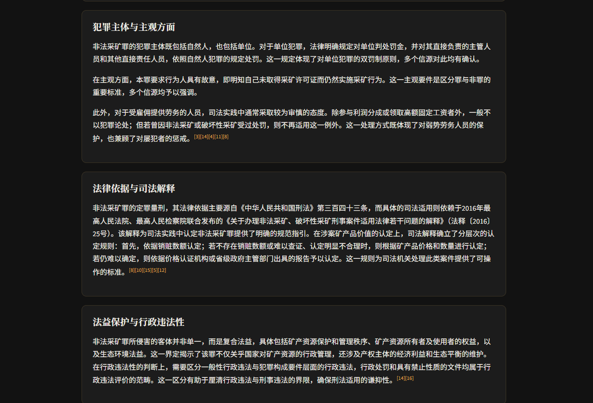

# Deep Research Agent

输入一个开放式研究问题,自动拆解、多来源并行检索、整合成带引用的结构化报告——遇到问题模糊或来源冲突,如实标出来,不假装确定。个人练手项目,目的是把 Tool Use / Planning / 长期记忆 / Multi-Agent 这几个 Agent 核心机制真正动手实现一遍,不是背定义。【注：后续的迭代方向是专注类案检索+分析，补齐阅卷工作的另一半内容】

- **一句话定位**:通用研究 Agent(不绑定单一领域),输入一个问题,输出一份带脚注引用、来源冲突时如实标注分歧的结构化报告,判断"信不信"这件事留给读者,系统只负责让每句话都能追溯到真实来源。
- **验证方式**:全流程用真实 Tavily 搜索 API + DeepSeek API 跑通,不是 mock 数据;每次生成报告都过一道引用校验(声称的结论必须能追溯到真实抓取的来源),校验不过的板块会被要求重写,不是跑完就算数。
- **技术栈**:Python + Streamlit(网页版)/ 纯终端(CLI版),DeepSeek(规划 + 推理 + 写作)+ Tavily Search API(检索,专为 AI Agent 场景设计)。

## 界面速览

| 输入问题 + 实时过程日志 | 报告正文(报纸式排版) |
|---|---|
|  |  |

| 编辑说明(引用可追溯 + 主动暴露不确定性) | 报告正文(续) |
|---|---|
|  |  |

以上为真实运行截图,问题是`非法采矿罪的构成要件是什么`。"编辑说明"那张截图里的`missing_data`/`conflict`标注不是摆拍——不同来源对"情节严重"的数额标准确实给出了不同数字,系统据实标了出来,没有挑一个数字装作确定。

## 这是什么问题

"研究"类任务和规则清晰的领域本质不同:没有一张可枚举的判定表,可靠性没法靠代码写死的规则兜底。这个项目的核心设计判断,是把"哪些决策能机械判定、哪些必须交给 LLM 判断"这条线画清楚:

- **规则型**(写死成代码,不交给 LLM 赌):工具调用次数上限(`MAX_TOOL_CALLS`)、子问题/主题数量上限、引用校验逻辑
- **权衡型**(没有固定答案,交给 LLM 判断):要不要再搜一轮、来源冲突时怎么处理、主题怎么分、报告怎么组织

可靠性 = 引用可追溯 + 主动暴露不确定性,不等于"内容一定为真"——这是开放式研究问题在架构层面绕不开的边界,不是没做好。真实运行案例见[示例输出](#示例输出)。

## 系统架构

```
研究问题 → [Planner] → 子问题列表 → [横向 Multi-Agent:并行 Researcher] → 证据台账
                                                                            ↓
                                                      [纵向 Multi-Agent 流水线:记者 → 笔杆子]
                                                                            ↓
                                                            [Synthesizer:组装 + 引用校验]
                                                                            ↓
                                                                结构化报告(带脚注引用)
```

按实际调用链路展开到文件一级:

```
用户提问
  └─ planner.py               判断问题是否够清楚,不清楚则反问;清楚则拆成 1~3 个子问题
      └─ run_research.py      并行派发给多个 Researcher(ThreadPoolExecutor)
          └─ agent.py         Tool Use 循环:LLM 通过 function calling 自主决定搜索/停止
              ├─ tools/search.py    真实 Tool Use——调用 Tavily Search API
              └─ tools/extract.py   从搜索结果里抽取跟问题相关的事实(纯 LLM 推理,非工具调用)
                  └─ storage.py     写入 SQLite 证据台账,同时兼作跨 session 长期记忆
      └─ synthesizer.py       编排下面两步 + 组装报告 + 引用校验(Reflection Loop)
          ├─ reporter.py          记者:核实证据、合并同一事实的多来源报道、分主题
          └─ writer.py            笔杆子:每个主题并行写一个板块,自选表格/时间线/列表/叙述
```

### Planner

独立的纯推理调用,刻意不带`tools`参数——这一步只做"问题够不够清楚、怎么拆"的判断,不涉及"要调用哪个工具",跟下面的 Tool Use 循环是两次完全不同的 LLM 调用。问题模糊时不瞎猜,提反问 + 给 2~4 个具体例子选项降低用户回答门槛,即使用户不按选项回答也没关系。

### Tool Use 循环 + 横向 Multi-Agent

`agent.py`里 LLM 通过 function calling 自主决定"搜/不搜、搜什么、什么时候停"(`search`/`finish`两个工具),不是写死的顺序代码——`dev_history/run_v1.py`到`run_v2.py`就是这次升级的真实记录。多个子问题对应多个 Researcher,`ThreadPoolExecutor`并行跑,同一个角色处理不同任务,是横向 Multi-Agent。硬性步数上限(`MAX_TOOL_CALLS`)是唯一保留的规则型控制,纯粹是稳定性兜底,防止 LLM 判断失误导致无限循环。

### 记者 → 笔杆子:纵向 Multi-Agent 流水线

同一个子问题拆出来的多条证据,原本直接堆给一个 LLM 写报告,内容单薄且组织混乱。改成两个角色接力:记者(`reporter.py`)先核实证据、合并同一事实的多来源报道、分主题、写导语;笔杆子(`writer.py`)按主题并行写作,每个板块自己判断该用表格、时间线、步骤列表还是叙述呈现。角色接力而不是同一个 prompt 换个说法调两次,是这里"纵向"的含义。

### Synthesizer:引用校验的 Reflection Loop

组装最终报告后跑一遍引用校验——声称的每句话是否真的能对应到证据台账里的`source_id`。校验不过时只重试对应有问题的板块,不是整篇报告重写,减少不必要的重复调用。这一步最初只做了"检测",没有真正闭环重试,后来补上了"发现问题→喂回具体问题→重新生成"这个环节才是完整的 Reflection Loop。

### 网页版

`app.py`复用`run_research.py`里的同一套底层逻辑,不是两份代码。后台线程(`ThreadPoolExecutor`)+`queue.Queue()`+ 主线程轮询驱动`st.status()`实时状态面板,配合`contextlib.redirect_stdout()`捕获跟 CLI 版一样的`print()`输出。

## 项目结构

```
deep_research_agent/
├── planner.py            Planner——判断问题是否清楚,不清楚则反问;清楚则拆解成子问题
├── agent.py              Tool Use 循环——LLM 通过 function calling 自主决定搜索/停止
├── reporter.py           记者——核实证据、合并同一事实的多来源报道、按主题分类(纵向流水线第一棒)
├── writer.py             笔杆子——每个主题并行写一个板块,自选表格/时间线/列表/叙述(纵向流水线第二棒)
├── synthesizer.py        编排记者+笔杆子、组装报告、引用校验(Reflection Loop,只重试有问题的板块)
├── storage.py            SQLite 证据台账,同时兼作长期记忆
├── retry.py              外部 API 调用的统一重试/退避逻辑
├── events.py             进度上报:终端打印 + 可选回调(网页端用来驱动实时状态面板)
├── context.py            统一注入"今天的日期",避免 LLM 按训练数据默认年份猜测时效性
├── tools/
│   ├── search.py             真实 Tool Use——调用 Tavily Search API
│   └── extract.py            从搜索结果里抽取跟问题相关的事实(LLM 推理,非工具调用)
├── run_research.py       终端入口:Planner → 并行 Researcher(横向Multi-Agent)→ 记者→笔杆子(纵向流水线)
├── app.py                网页入口(Streamlit),复用同一套逻辑,后台线程+实时状态面板,报纸式排版
├── dev_history/          开发过程的历史版本,不是当前系统的一部分(见下方说明)
├── requirements.txt
└── .env.example
```

**`dev_history/`**——保留下来是因为这几个文件本身就是"演进过程"的证据,比如`run_v1.py`(写死顺序)到`run_v2.py`(LLM自主决策)展示了 Tool Use 循环具体是怎么从规则型升级成真正的 Planning 的。不会被`run_research.py`或`app.py`引用,可以运行但不代表系统当前行为。

## 运行方式

```bash
pip install -r requirements.txt
cp .env.example .env   # 填入真实的 TAVILY_API_KEY 和 DEEPSEEK_API_KEY
```

**网页版**(带实时推理过程展示、报纸式排版)

```bash
streamlit run app.py
```

**终端版**(直接看代码和真实日志)

```bash
python run_research.py
```

两者跑的是同一套底层逻辑,网页版只是在外面包了一层展示,不是两份代码。单次运行大约 2-5 分钟(取决于子问题数量和检索到的来源数)。

## 示例输出

问题:`今日国际原油价格是多少`,终端版真实运行结果(节选):

> **国际油价8月11日大幅跳涨：布伦特逼近88美元，WTI突破82美元**
>
> 2026年8月11日，国际原油价格显著上涨，布伦特原油期货收于每桶87.72美元，涨幅约5%；WTI原油期货收于每桶82.13美元，涨幅约5.1%。此轮上涨主要受地缘政治风险推动，包括美伊和谈僵局及霍尔木兹海峡航运协议前景不明。多家机构上调2026年油价预测，但市场对短期价格波动仍存分歧。
>
> ……（WTI原油价格板块节选）2026年8月11日，WTI原油期货价格出现显著波动。据多方报道，9月合约收于每桶82.13美元，上涨3.95美元，涨幅5.05%；另有报道称涨幅扩大至5%，报82.11美元/桶……然而，不同来源的数据存在差异，有报道显示当前价格为93.96美元……综合来看，8月11日WTI原油价格存在多种报价，可能因数据来源或统计口径不同而有所差异，但整体呈现上涨趋势。

这段就是"可靠性 = 引用可追溯 + 主动暴露不确定性"这条设计原则的真实体现:多个来源报价对不上时,报告没有挑一个数字硬写,而是如实列出差异、给出可能原因,每句话背后都能对应到具体来源(脚注引用,此处节选未展示)。

<details>
<summary><b>值得展开讲的工程细节</b>(点击展开)</summary>

- **搜索源中途真的挂了,不是假设的容灾场景**:开发后期博查(Bochaai)API 突然连 TLS 握手都完不成,不只是这一个接口,连他们的控制台域名都握手失败。没有停在"重试几次"上,用`curl`分别测了目标域名、DeepSeek、百度三个对照组,确认是博查一家的问题;进一步测了消费端域名`bocha.cn`同样握手失败,排除"只是这一个 API 子域名限流"的可能,再决定整体换成 Tavily。换源只改了`tools/search.py`一个文件,因为对外返回的字典形状(`name/url/snippet/summary/date_published`)从一开始就跟具体搜索源解耦,`agent.py`/`extract.py`完全没动。
- **Reflection Loop 最初是假的,只检测不重试**:引用校验器一开始真的能发现"这句话没有对应来源"这类问题,但发现之后什么都没做,报告原样返回——这不是 Reflection Loop,只是个检测器。后来才补上"把具体问题喂回去、只重新生成有问题的板块"这个闭环,才是真正的生成→校验→重试。
- **默认`max_tokens`不设等于埋了个定时炸弹**:DeepSeek API 默认`max_tokens=4000`,Reporter 一步要生成的 JSON(多主题 + 导语 + 说明)经常超过这个长度,曾经真实触发过`JSONDecodeError: Unterminated string`——报告写到一半被硬切断。修复是给所有 5 个 LLM 调用点显式设置`max_tokens`,并给 Reporter 加了一道"截断了就换更精简的 prompt 重试一次"的安全网。
- **同一个 URL 被当成两条独立来源,证据可信度被悄悄注了水**:不同搜索结果偶尔会返回`www.`/`m.`等前缀不同但内容相同的 URL,被当成两个独立信源,人为拉高了"多来源印证"的分量。修复是`normalize_url()`统一剥离常见移动端/带www前缀再判重,不是简单的字符串全等比较。
- **Streamlit 长阻塞脚本运行期间,旧的界面元素不会自动消失**:用户提交完模糊问题的反问表单后,旧的表单控件还留在"研究进行中"内容下面没消失——根因是 Streamlit 长时间阻塞运行的脚本不会主动清理之前渲染过的元素。修复是用`st.empty()`占位符,每次运行都显式清空或重新渲染,不依赖 Streamlit 自动回收。

</details>

## 已知局限

<details>
<summary><b>点击展开</b></summary>

- 单次运行约 2-5 分钟,没有做流式/增量展示之外的性能优化
- 只接了 Tavily 一个搜索源,来源多样性受限于这一个 API 的索引范围
- 没有系统性的多轮自动化评测(准确率、引用有效率等跨多个问题的统计),目前是单次跑通 + 引用校验通过,不是刑事阅卷 Agent 那种"多个真实案例、量化对比修复前后指标"级别的验证
- 长期记忆只做到"存历史证据、检索时可查",没有做记忆的自动摘要/遗忘机制

</details>

## 核心设计取舍

- **规则型 vs 权衡型**:能枚举、能机械判定的写死成代码(工具调用次数上限、引用校验、子问题/主题数量上限);
  没有固定答案的交给 LLM 判断(要不要再搜、主题怎么分、报告怎么组织、来源冲突怎么处理)。
- **两种方向的 Multi-Agent**:横向并行(多个 Researcher 同时查不同子问题)+ 纵向流水线(记者→笔杆子角色接力,
  笔杆子内部同样并行)。两种模式都是真实跑通的代码,不是同一个东西换了个名字。
- **可靠性 = 引用可追溯 + 主动暴露不确定性**,不等于"内容一定为真"——这是开放式研究问题在架构层面
  没法回避的边界,不是没做好。引用不直接展示原始 source_id,渲染成脚注编号,但底层校验逻辑不受影响——
  呈现好看和可追溯这两件事没有冲突,只是分了显示层和数据层。

## 关于这个项目的定位

实践 Tool Use / Planning / 长期记忆 / Multi-Agent 这四个核心机制，为后续的律师工作台开发做铺垫。

## 许可证

[PolyForm Noncommercial License 1.0.0](LICENSE)——可自由查看、学习、非商业用途使用，不可商用。
